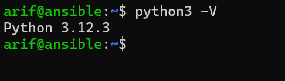

## Install Nginx Menggunakan Ansible

Untuk meggunakan perintah ansible playbook yang pertama saya persiapkan sebagai berikut :

1. Saya membuat 2 Vm Ubuntu 24.04 LTS di AWS (Vm ansible & Vm Nginx), buka port 9091 di vm nginx.


2. Download KeyPair .pem serta pindahkan key tersebut ke dalam folder `.ssh`


3. Lalu masuk kedalam vm masing-masing menggunakan ssh yang disediakan oleh console aws

```
     ssh -i kunci.pem namauser@namaserver
```
4. Update vm masing-masing
```
   sudo apt update 
```
5. Install ansible di Vm ansible disini Saya mengikuti panduan penginstallan ansible diwebsite resminya seperti berikut

Link Panduan install ansible di ubuntu :
```
https://docs.ansible.com/ansible/latest/installation_guide/installation_distros.html
```
   

  

 
8. Cek versi ansible


9. Cek versi python3

    

10. Buat ssh keygen di vm ansible
    ```
    ssh-keygen -t rsa
    ```
11.Copas isi file `id_rsa.pub` di dalam vm ansible ke dalam vm nginx paste file `authorized_keys`

  

12. Masuk kembali ke vm ansible buat file `ansible.cfg` isinya untuk mengarakan inventory file ansible ke file Inventory, dan private keys nya di simpan dimana serta alarm (pemberitahuan python di diamkan)

     

13. Lalu buat file `Inventory` dimana didalam isinya ditujukan konfigurasi ansible ditujukan di vm mana, variable pendukung seperti ansible user, interpreter ansible python ini disimpan dimana.

    

14. Cek konfigurasi `ansible.cfg` & `Iventory` sudah benar belum dengan perintah

```
    ansible nginx -m ping
```
   


15. Buat Folder `templates` yang digunakan untuk menyimpan file `nginx.conf.j2` yang berisi perintah untuk mendegarkan port berapa, Perintah server name mendegarkan dan melayani semua (-) host, acces log perintah untuk pecatatn dan penyimpanan permintaan klien. Perintah error log menentukan file tempat server akan mencatat pesan error, Blok location ini mendefinisikan bagaimana Nginx akan menangani permintaan untuk jalur URL tertentu dalam blok server ini.

     

16. Buat file `install-nginx.yaml` yang berisi untuk name digunakan untuk menamai konfigurasi apa yang akan di lakukan di playbook, host digunakan untuk menargetkan vm mana yang akan di install, become digunakan untuk mengaktifkan akses hak tinggi (root), task memulai konfigurasi, `state:present` digunakan untuk eksekusi perintah install nginx pada saat playbook dijalankan, `update_cache:yes` digunakan menyegarkan paket sbelum instalasi, 'template' eksekusi untuk mendengarkan port 9091 ini menggunakan template yang di simpan di file nginx.conf.j2 dan di tujukan folder dan file `/etc/nginx/sites-available/default` di vm nginx, lalu selanjutnya 'Enable NGINX site' digunakan setelah nginx konfigurasi telah berhasil terintsal yang tersimpan di dalam `/etc/nginx/sites-available/default` dan akan diarahkan ke `/etc/nginx/sites-enabled/default`, Handler bertugas untuk merestart nginx setelah konfigurasi selesai.

    

17. Jalankan file `.yaml` dengan perintah berikut
```
      ansible-playbook install-nginx.yaml
```

 
18. Masuk kedalam vm nginx dan lihat apakah sudah berjalan nginx di port 9091


19. Masuk kebrowser ketik Ip vm nginx beserta port 9091

  